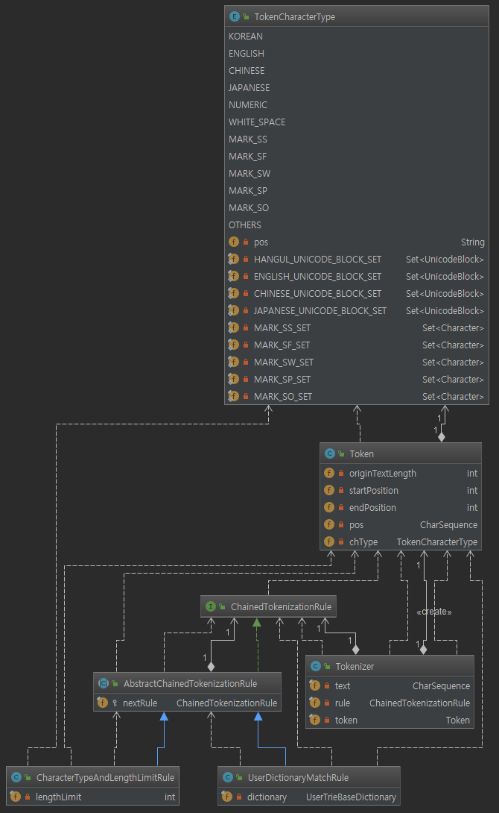
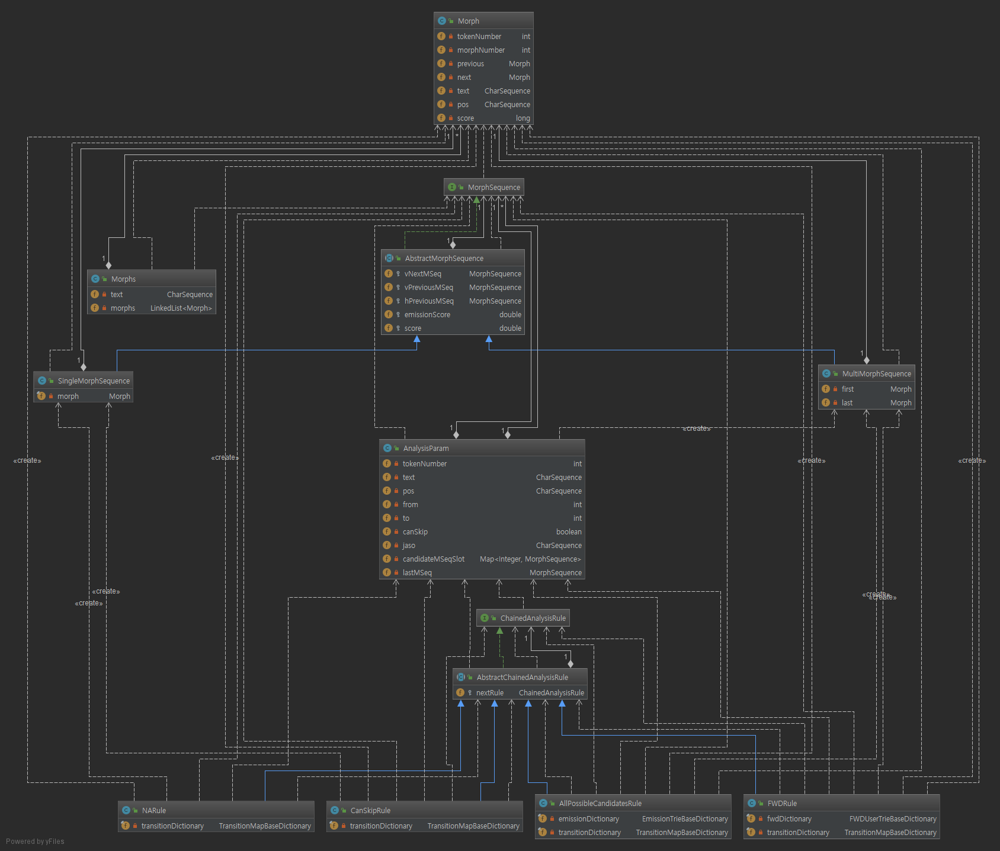
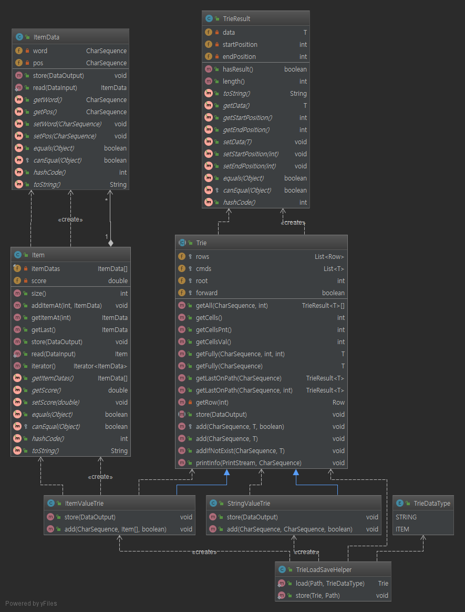

# 1. KLAY
[](https://travis-ci.com/ks-shim/klay)
[](https://coveralls.io/github/ks-shim/klay?branch=master)

**K**orean **L**anguage **A**nal**Y**zer using KOMORAN's dictionaries.
- korean morphology analysis
- 한국어 형태소 분석기 입니다.
- 개발 시작일 : 2019. 02 ~
  - version : 0.1 (2019.02.26)
- KOMORAN의 사전을 기반으로 분석하며, 사용하는 Data structure와 분석 방식은 상이합니다.
- Data Structure : KLAY의 분석 방식에 맞게 수정한 Lucene의 Trie를 사용합니다.
- KLAY is a thread-safe analyzer. (멀티 쓰레드 환경에서의 사용을 권장합니다.)


# 2. Architecture
Performance와 동시에 확장성을 고려하였으며 Readability에 많은 신경을 썼습니다. 그래서 조금 더 자바(Java)스럽게 Design하였습니다.
## 2-1. Tokenization
Chain of Responsibiility 패턴을 사용하여 구현하였습니다. ChainedTokenizationRule 인터페이스를 구현하여 Rule을 쉽게
추가할 수 있습니다. 현재는 아래와 같은 Rule을 순차적으로 적용하고 있습니다.
 - UserDictionaryMatchRule : 사용자 사전에 매칭하는 Rule
 - CharacterTypeAndLengthLimitRule : 문자타입 및 길이 제한 Rule



## 2-2. Analysis
마찬가지로 Chain of Responsibility 패턴을 사용하여 구현하였습니다. ChainedAnalysisRule 인터페이스를 구현하여 Rule을 쉽게
추가할 수 있습니다. 현재는 아래와 같은 Rule을 순차적으로 적용하고 있습니다.
 - CanSkipRule : 분석없이 생략할 수 있는 Rule
 - FWDRule : 기분석 사전으로 Fully 매칭하는 Rule
 - AllPossibleCandidateRule : 미등록어 추정 Rule
 - NARule : 분석 불가 Rule

HMM(Viterbi)는 MorphSequence 클래스를 사용하여 계산되어집니다.



## 2-3. Dictionary
Lucene의 Trie를 변형하여 적용하였습니다.



# 3. Example
```java
    //***********************************************************************
    // 1. configuration and creating Klay object ...
    //***********************************************************************
    Klay klay = new Klay(Paths.get("data/configuration/klay.conf"));

    //***********************************************************************
    // 2. start morphological analysis.
    //***********************************************************************
    String text = "너무기대안하고갔나....................재밌게봤다";
    Morphs morphs = klay.doKlay(text);

    //***********************************************************************
    // 3. print result.
    //***********************************************************************
    Iterator<Morph> iter = morphs.iterator();
    while(iter.hasNext()) {
        System.out.println(iter.next());
    }
```
# 4. Performance
## 4-1. 사양 및 데이터
 - 프로세서 : Intel(R) Core(TM) i7-6700K CPU @ 4.00GHz, 4008Mhz, 4코어, 8 논리 프로세서
 - 메모리 : 32.0 GB
 - 분석 데이터 위치 : data/performance/test.txt
 - 분석 데이터 건수 : 199,992 건
## 4-2. 결과 및 코드
 - 사전 로딩 : 0.284 (s)
 - 분석 시간 : 16.815 (s)
```java
    String src = "data/performance/test.txt";
    Klay klay = new Klay(Paths.get("data/configuration/klay.conf"));

    StopWatch watch = new StopWatch();
    watch.start();
    int count = 0;
    try (BufferedReader in = new BufferedReader(new FileReader(src))) {
        String line = null;
        while((line = in.readLine()) != null) {
            line = line.trim();
            if(line.isEmpty()) continue;

            klay.doKlay(line);
            System.out.print("\r" + ++count);
        }
    }
    watch.stop();
    System.out.println("Analysis Time : " + watch.getTime(TimeUnit.MILLISECONDS) / 1000.0 + " (s)");
```

# 5. Elasticsearch Plugin
 - Download : https://github.com/ks-shim/klay-es-plugin
 
# 6. Resources 
 - Dictionary : https://github.com/ks-shim/klay-resources/tree/master/dictionary
 - Configuration : https://github.com/ks-shim/klay-resources/tree/master/configuration
 
# 7. Maven
```
<dependency>
  <groupId>io.github.ks-shim.klay</groupId>
  <artifactId>klay-common</artifactId>
  <version>0.3</version>
  <type>pom</type>
</dependency>
```
```
<dependency>
  <groupId>io.github.ks-shim.klay</groupId>
  <artifactId>klay-dictionary</artifactId>
  <version>0.3</version>
  <type>pom</type>
</dependency>
```
```
<dependency>
  <groupId>io.github.ks-shim.klay</groupId>
  <artifactId>klay-core</artifactId>
  <version>0.3</version>
  <type>pom</type>
</dependency>
```
